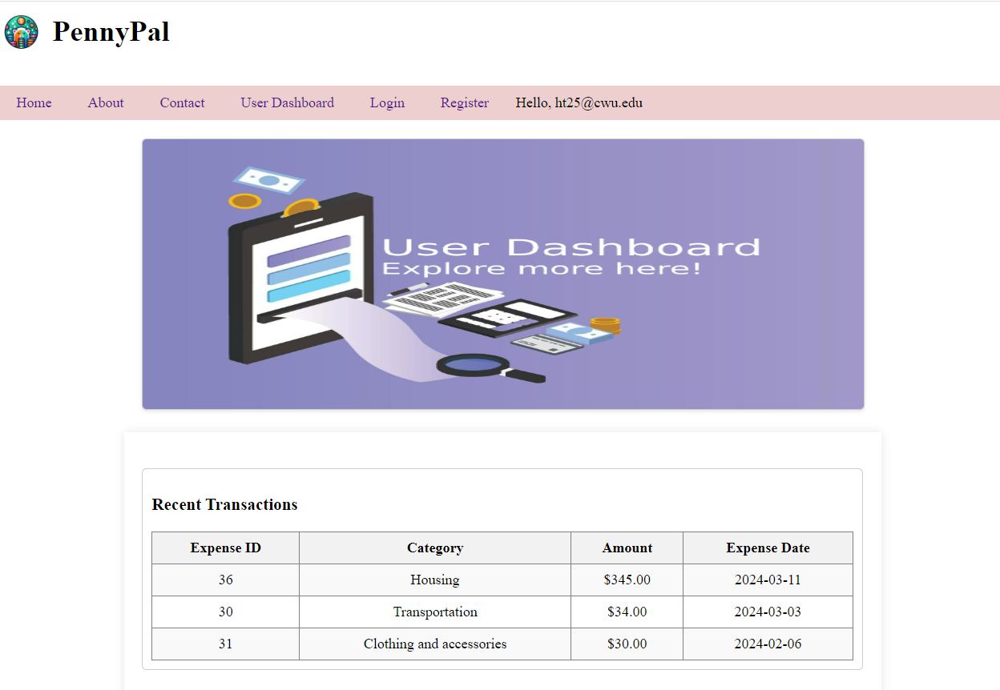
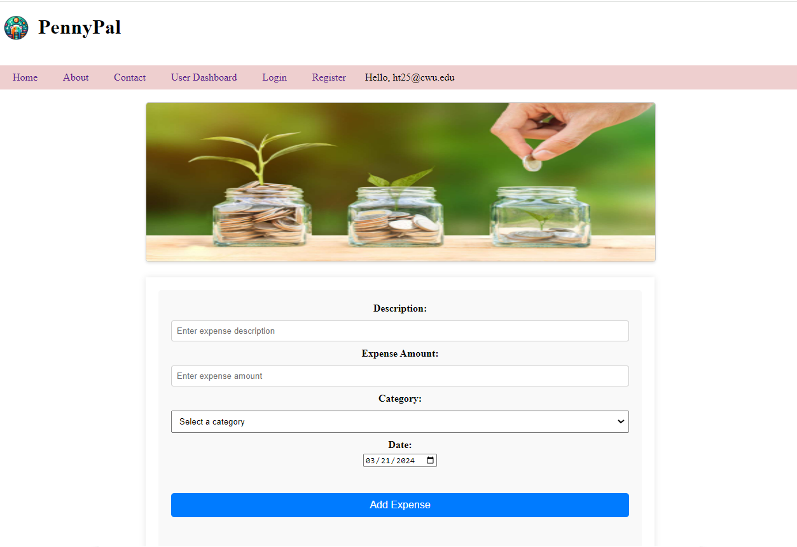

# PennyPal - Online Budget Tracker

## About

PennyPal is a web-based budgeting tool developed by TechTide. It aims to simplify personal finance management by providing users with a user-friendly platform to set budgets, track expenses, and gain insights into their spending habits. Whether you're managing your personal finances, running a small business, or organizing a student club, PennyPal can help you achieve your financial goals.

## Features

- **Expense Tracking:** Easily log and categorize your expenses to keep track of your spending habits.
- **Budget Management:** Set budgets for different expense categories and monitor your spending to stay within your financial limits.
- **Financial Reporting:** Generate detailed reports to analyze your financial performance, including monthly and yearly summaries of your expenses and budgets.
- **User Authentication:** Securely log in to your PennyPal account to access your financial data and protect your privacy.

## Screenshots

*Dashboard: View a summary of your finances at a glance.*

*Expense Tracking: Log and categorize your expenses with ease.*

## Installation

To install PennyPal locally, follow these steps:

1. Install XAMPP on your device. You can download XAMPP from https://www.apachefriends.org/index.html.
2.	Clone the source code from GitHub: https://github.com/tuho9428/PennyPal
3.	Download  the source code for phpmailer from GitHub: https://github.com/PHPMailer/PHPMailer
4.	Place the folder named PennyPal and phpmailer into C:\xampp\htdocs\.
5.	Start Apache and MySQL in XAMPP.

## Set up the database

1.	Open XAMPP and start Apache and MySQL.
2.	In the MySQL row, click on "Admin"; a web browser will open.
3.	Create a database named “mydata”.
4.	Use the query.sql file in the folder named 'public' to create database tables.

## Accessing PennyPal

1.	Open a modern web browser (e.g., Google Chrome, Mozilla Firefox, Safari).
2.	Type http://localhost/PennyPal/ in the address bar and press Enter.
3.	Sign up for a new account or log in with your existing credentials.
3.  Explore the different features of PennyPal, including expense tracking, budget management, and financial reporting.

## Contributing

We welcome contributions from the community to help improve PennyPal. If you'd like to contribute, please follow these guidelines:

- Submit bug reports or feature requests through the GitHub issue tracker.
- Fork the repository, make your changes, and submit a pull request with a detailed description of your changes.
